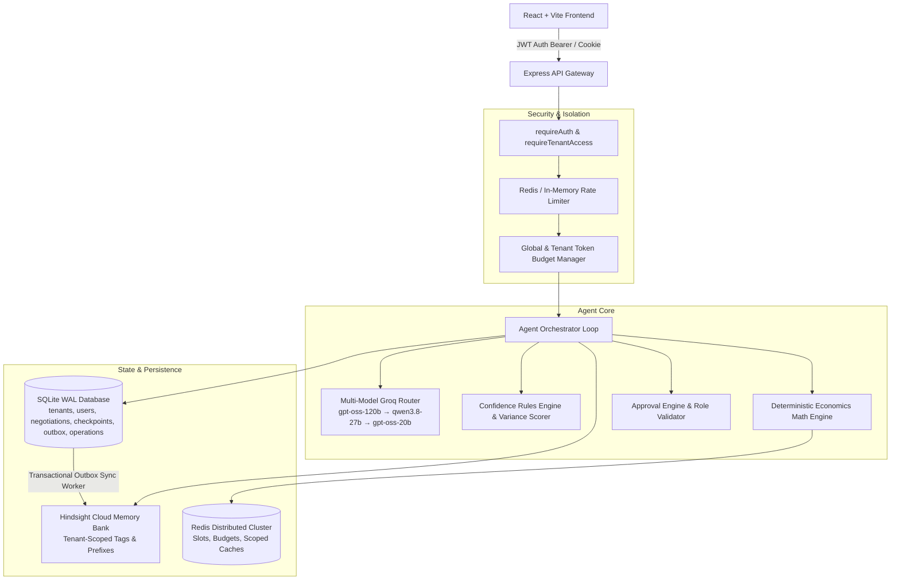

# DealMind 2.1 — Production Deployment & Architecture Guide

## Overview

DealMind 2.1 is an enterprise-grade AI negotiation intelligence workspace. It combines deterministic financial calculation engines, multi-model LLM routing with rate-limit recovery, durable agent execution checkpoints, multi-tenant isolation, cryptographically secure authentication, and cloud-synced persistent memory via Hindsight and Redis.

---

## 1. Architecture Summary



---

## 2. Prerequisites & System Requirements

- **Node.js**: v18.0.0 or higher (v20+ / v22+ recommended)
- **NPM**: v9.0.0 or higher
- **Redis (Optional)**: Redis 6.2+ / 7.0+ (Automatic graceful fallback to in-memory coordination if omitted)
- **SQLite**: Bundled via `better-sqlite3` with WAL mode enabled.
- **Provider Credentials**:
  - `GROQ_API_KEY`: Groq Cloud API key for multi-model agent orchestration.
  - `HINDSIGHT_API_KEY`: Vectorize Hindsight API key for long-term semantic memory.

---

## 3. Environment Variables Reference

Create `.env` in `server/` or pass via environment variables:

| Variable | Required | Default | Description |
|---|---|---|---|
| `PORT` | No | `5000` | Port for Express backend server |
| `JWT_SECRET` | **Yes (Prod)** | `dealmind_enterprise_jwt_secure_secret_...` | HMAC-SHA256 secret key for signing access tokens |
| `JWT_EXPIRES_IN` | No | `7d` | Token expiry duration (e.g. `7d`, `24h`) |
| `DEFAULT_TENANT_ID` | No | `tenant_default` | Default tenant identifier for legacy/unauthenticated migrations |
| `GROQ_API_KEY` | No | `""` | API key for Groq Cloud. Operates in deterministic mode if empty |
| `HINDSIGHT_API_KEY`| No | `""` | API key for Vectorize Hindsight Cloud |
| `HINDSIGHT_BASE_URL`| No | `https://api.hindsight.vectorize.io` | Hindsight API base URL |
| `HINDSIGHT_BANK_ID`| No | `dealmind` | Shared memory bank identifier |
| `REDIS_URL` | No | `""` | Connection URI for Redis (`redis://host:port`). Uses in-memory fallback if empty |
| `TOKEN_BUDGET_GLOBAL` | No | `2000000` | Global token consumption limit |
| `TOKEN_BUDGET_PER_TENANT` | No | `500000` | Token limit per tenant |
| `MAX_CONCURRENT_TURNS` | No | `5` | Maximum parallel agent execution turns per tenant |
| `SQLITE_PATH` | No | `./data/dealmind.sqlite` | SQLite database file location |

---

## 4. Setup & Installation

### Step 1: Install Dependencies

```bash
# Install Server Dependencies
cd server
npm install

# Install Client Dependencies
cd ../client
npm install
```

### Step 2: Database Initialization & Seeding

On server launch, SQLite automatically runs schema migrations, generates tables with WAL mode, and provisions the default tenants and administrative accounts:

Default Seed Accounts:
- **Admin**: `admin@dealmind.local` | Password: `Password123!` (Tenant: `tenant_default`)
- **Manager**: `manager@dealmind.local` | Password: `Password123!` (Tenant: `tenant_default`)
- **Sales Rep**: `sales@dealmind.local` | Password: `Password123!` (Tenant: `tenant_default`)
- **Secondary Tenant Admin**: `tenant2_admin@dealmind.local` | Password: `Password123!` (Tenant: `tenant_secondary`)

### Step 3: Run Full Test Suite

```bash
cd server
npm test
```
*Expected: 22/22 tests pass + 8/8 evaluation benchmarks pass (100% score).*

### Step 4: Build Frontend Assets

```bash
cd client
npm run build
```
*Outputs production bundle to `client/dist/`.*

---

## 5. Security & Isolation Model

1. **Authentication**:
   - Cryptographic password hashing via `bcryptjs` with 10 salt rounds.
   - Stateless JWT tokens containing `userId`, `tenantId`, `role`, and `email`, validated on every protected route.
2. **Role-Based Access Control (RBAC)**:
   - `requireRole(['ADMIN', 'MANAGER'])`: Restricted approval workflows and administrative audit endpoints.
   - Sales reps cannot approve their own discount exceptions.
3. **Multi-Tenant Isolation**:
   - All SQLite queries enforce `WHERE tenant_id = ?`.
   - Hindsight documents are prefixed with `${tenantId}::${docId}` and tagged with `tenant:${tenantId}`, with strict server-side recall filtering.
   - Distributed concurrency slots and token budgets are partitioned per `tenant_id`.
4. **Crash Consistency & Transactional Outbox**:
   - Outcome recording executes atomically in SQLite alongside an outbox event.
   - The background outbox worker drains pending events with exponential backoff and jitter. Records failing 5 attempts transition to `FAILED` status for administrative inspection.
5. **Operation Idempotency**:
   - `agent_operations` table tracks unique `idempotency_key`s per tenant, preventing duplicate state modifications upon network replay.

---

## 6. Observability & Health Check

- **Health Endpoint**: `GET /api/health`
  Returns server uptime, SQLite connection status, Redis distributed mode status, Groq multi-model router cooldowns, and Hindsight cloud connectivity.
- **SSE Stream**: `GET /api/negotiate/stream?sessionId=<id>`
  Streams live agent reasoning steps with sequence numbers, step timing, and support for `Last-Event-ID` reconnection replay buffer.
